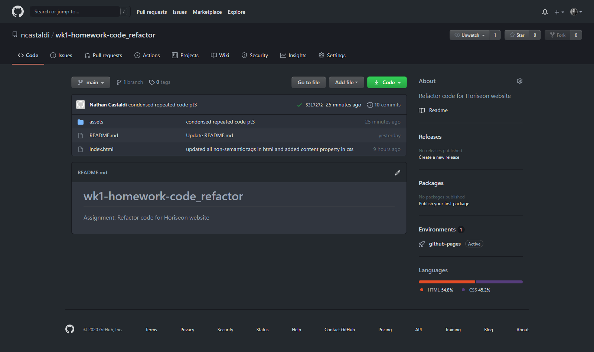

# Assignment: Refactor code for Horiseon website

## Description 

For this assignment, we were asked to refactor an existing single-page website for Horiseon. We were instructed to pay extra attention accessibility and semantic HTML code.

I replaced all non-semantic HTML tags in 'index.html' with their semantic counterparts. Within the 'style.css' file, I condensed repeated code to make the site easier to maintain.

I also added a reset.css file.

Live Site: [https://www.castaldi.dev/hw1-code_refactor/](https://www.castaldi.dev/hw1-code_refactor/)

## Table of Contents

* [Installation](#installation)
* [Usage](#usage)
* [License](#license)
* [Badges](#badges)

## Installation

Installation requires uploading the application files and folders to root of web server.

## Usage 

Provide instructions and examples for use. Include screenshots as needed.

GitHub Repository: [https://github.com/ncastaldi/hw1-code_refactor/](https://github.com/ncastaldi/hw1-code_refactor/)

Live Site: [https://www.castaldi.dev/hw1-code_refactor/](https://www.castaldi.dev/hw1-code_refactor/)

## License

MIT License

Copyright (c) [2020] [Nathan Castaldi]

Permission is hereby granted, free of charge, to any person obtaining a copy
of this software and associated documentation files (the "Software"), to deal
in the Software without restriction, including without limitation the rights
to use, copy, modify, merge, publish, distribute, sublicense, and/or sell
copies of the Software, and to permit persons to whom the Software is
furnished to do so, subject to the following conditions:

The above copyright notice and this permission notice shall be included in all
copies or substantial portions of the Software.

THE SOFTWARE IS PROVIDED "AS IS", WITHOUT WARRANTY OF ANY KIND, EXPRESS OR
IMPLIED, INCLUDING BUT NOT LIMITED TO THE WARRANTIES OF MERCHANTABILITY,
FITNESS FOR A PARTICULAR PURPOSE AND NONINFRINGEMENT. IN NO EVENT SHALL THE
AUTHORS OR COPYRIGHT HOLDERS BE LIABLE FOR ANY CLAIM, DAMAGES OR OTHER
LIABILITY, WHETHER IN AN ACTION OF CONTRACT, TORT OR OTHERWISE, ARISING FROM,
OUT OF OR IN CONNECTION WITH THE SOFTWARE OR THE USE OR OTHER DEALINGS IN THE
SOFTWARE.

## Badges

